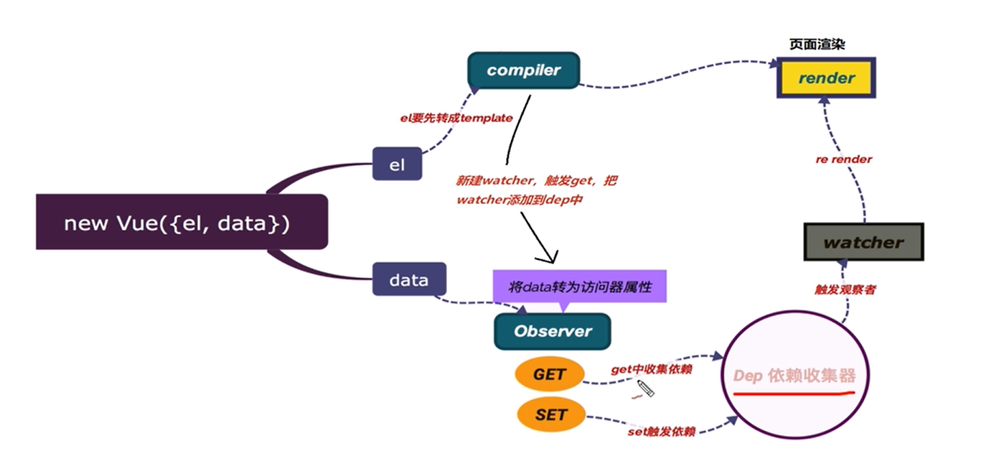

## 创建 vue 的构造方法



```html{4}
<!DOCTYPE html>
<html lang="en">
  <head>
    <meta charset="UTF-8" />
    <meta name="viewport" content="width=device-width, initial-scale=1.0" />
    <meta http-equiv="X-UA-Compatible" content="ie=edge" />
    <title>Document</title>
    <script src="../dist/vue.js"></script>
  </head>
  <body>
    <div id="app">
      <p>{{msg}}</p>
      <p v-text="msg"></p>
    </div>
    <script>
      var vm = new Vue({
        el: '#app',
        data: {
          msg: 'hello world',
          info: 'aa'
        }
      })
    </script>
  </body>
</html>
```

```js {4}
class Vue {
  constructor(options) {
    this.$el = document.querySelector(options.el);
    this.$data = options.data || {};
    new Observer(this.$data);
    new Compiler(this);
  }
```

## 创建 observer

```js {4}
export default class Observer {
  constructor(data) {
    this.data = data
    this.walk(data)
    //遍历对象完成所有数据的劫持
  }

  walk(data) {
    if (!data || typeof data !== 'object') {
      return
    }
    Object.keys(data).forEach(key => {
      this.defineReactive(data, key, data[key])
    })
  }

  defineReactive(data, key, value) {
    Object.defineProperty(data, key, {
      enumerable: true,
      configurable: false,
      get: () => {
        console.log('get')
        return value
      },
      set: newValue => {
        console.log('触发了set')
        value = newValue
      }
    })
    this.walk(value)
  }
}
```

## 数据劫持

```js {4}
import Compiler from './compiler'
import Observer from './observer.js'

class Vue {
  constructor(options) {
    this.$el = document.querySelector(options.el)
    this.$data = options.data || {}

    this._proxyData(this.$data)
    this._proxyMethod(options.methods)

    new Observer(this.$data)
    new Compiler(this)
  }

  /**
   * 代理数据
   * @param {*} data
   */
  _proxyData(data) {
    Object.keys(data).forEach(key => {
      Object.defineProperty(this, key, {
        set(newValue) {
          data[key] = newValue
        },
        get() {
          return data[key]
        }
      })
    })
  }

  /**
   * 代理函数
   * @param {*} methods
   */
  _proxyMethod(methods) {
    if (methods && typeof methods === 'object') {
      Object.keys(methods).forEach(key => {
        this[key] = methods[key]
      })
    }
  }
}

window.Vue = Vue
```
